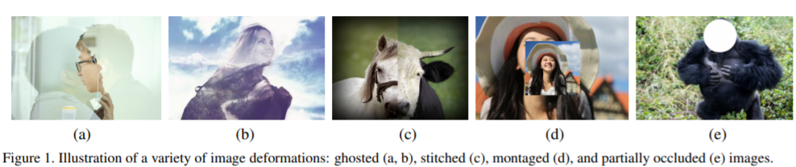
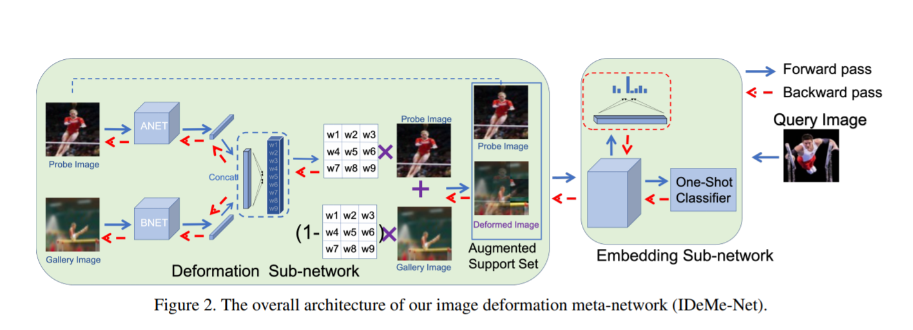
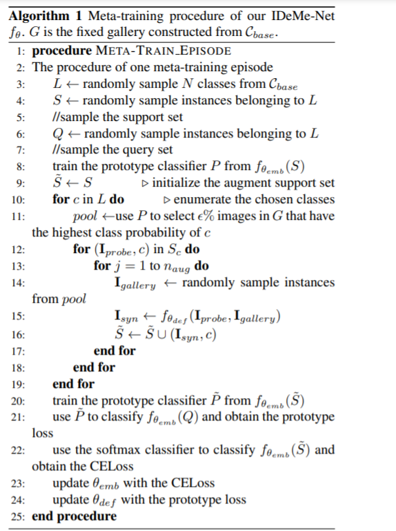

# Image-Deformation-Meta-Networks-for-One-Shot-Learning

## This is the implementation of the paper "Image Deformation Meta-Networks for One-Shot Learning"(CVPR 2019 Oral) in pytorch

## About this paper
#### Data: https://deepai.org/dataset/imagenet
#### CSV files: https://github.com/yaoyao-liu/mini-imagenet-tools/tree/main/csv_files
Visual recognition systems may perform better one-shot learning, or learning concepts from a single or few examples, if they mimic the same behavior and synthesize distorted instances of new concepts. The primary takeaway is that, though the deformed images may not be visually realistic, they still contain important semantic information and play a substantial role in determining classifier decision limits

This Image Deformation Meta-Network (IDeMe-Net) thus consists of two components:
1. Deformation subnetwork
2. Embedding sub-network.

1. The Deformation sub-network learns to generate the deformed images by linearly fusing the patches of probe and gallery images. Specifically, it treats the given small training set as the probe images and sample additional images from the base categories to form the gallery images.
2. Embedding sub-network, which maps images to feature representations and performs one-shot classification. The entire network is trained in an end to-end meta-learning manner on base categories.

## Training Strategy of IDeMeNet

This paper proposes a conceptually simple yet powerful approach to address one-shot learning that uses a trained image deformation network to generate additional examples. This deformation network leverages unsupervised gallery images to synthesize deformed images, which is trained end-to-end by meta-learning

Use the pre trained Deformation model provided by the author softRandom.t7
I did train for couple of epochs but my system ran out of memory. If you train , please feel free to share the results **vikramreddy0307 AtTheRate gmail.com**
